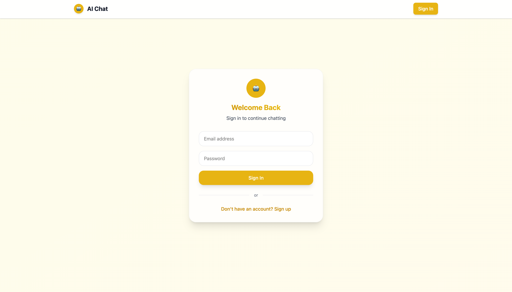

# GPT Integration Template

🚀 A battle-tested foundation for building AI integrated solutions with Next.js. Skip weeks of setup and dive straight into creating intelligent applications that scale from MVP to enterprise.


_Your AI application foundation - clean, extensible, and ready for rapid development_

## ⚡ What You Get Out of the Box

This isn't just another starter template. It's a carefully crafted foundation that handles the complex infrastructure so you can focus on building something amazing:

-   **🧠 Smart AI Integration**: OpenAI GPT-4o-mini with streaming responses and customizable personalities
-   **🔐 Bulletproof Auth**: Supabase authentication with social providers and admin controls
-   **📊 Production Database**: PostgreSQL with Row Level Security - your data is safe and scalable
-   **⚡ Modern Stack**: Next.js 15, React 19, TypeScript - the tools that power today's best apps
-   **🎨 Beautiful UI**: Tailwind CSS components that look great and work everywhere


_Authentication flows that actually work - multiple providers, secure sessions, admin controls_

## 🎯 Perfect Foundation For

Transform this foundation into any AI-powered solution you can imagine:

### 🏢 Enterprise Solutions

-   **Customer Support Bots** - Handle queries 24/7 with intelligent escalation
-   **Content Generation Platforms** - Scale your content team with AI assistance
-   **Data Analysis Assistants** - Turn spreadsheets into insights automatically

### 🎓 Educational Platforms

-   **Personalized Tutoring Systems** - Adapt to each student's learning style
-   **Automated Assessment Tools** - Grade assignments and provide detailed feedback
-   **Interactive Learning Companions** - Make studying engaging and effective

### 🎨 Creative Applications

-   **Writing Assistants** - From blogs to novels, AI that understands your voice
-   **Design Collaboration Tools** - Brainstorm, iterate, and refine ideas together
-   **Interactive Storytelling** - Create immersive narratives that respond to users

### 💼 Business Automation

-   **Sales Intelligence** - Qualify leads and personalize outreach at scale
-   **Market Research Tools** - Analyze trends and competitors automatically
-   **Knowledge Management** - Turn company documents into searchable intelligence


_Smooth chat experience with real-time streaming and persistent conversation history_

## 🚀 Get Started in Minutes

### Prerequisites

-   Node.js 18+ (the modern standard)
-   A Supabase account (free tier is perfect for getting started)
-   OpenAI API key (start small, scale when ready)

### Lightning Setup

```bash
# Clone and install
git clone <your-repo>
cd gpt-integration-template
npm install

# Environment setup
cp .env.example .env.local
# Add your keys to .env.local - we'll guide you through this

# Database magic
# Just run the provided SQL in your Supabase dashboard

# Launch your AI app
npm run dev
```

**🎉 That's it!** Your AI application is running at `http://localhost:3000`

## 🛠 Build Something Unique

The real power is in how easy it is to make this template your own:

### 🎭 Custom AI Personalities

Create specialized AI assistants in minutes:

```typescript
// In src/app/api/chat/route.ts
const systemPrompts = {
    chef: "You're a world-class chef who makes cooking accessible and fun...",
    therapist: "You provide gentle, evidence-based mental health support...",
    codeReviewer:
        "You're a senior engineer who helps write bulletproof code...",
    // Your unique AI personality here
};
```

### 📈 Scale Your Data Model

The PostgreSQL foundation grows with your ambitions:

```sql
-- Add whatever your app needs
CREATE TABLE projects (
    id UUID PRIMARY KEY,
    user_id UUID REFERENCES auth.users(id),
    name TEXT NOT NULL,
    ai_settings JSONB DEFAULT '{}'
);
```

### 🎨 Make It Yours

Every component is designed for customization:

-   **Styling**: Tailwind classes that adapt to your brand
-   **Features**: Modular components you can mix and match
-   **Integrations**: Clean API patterns for connecting anything


_Development tools that actually help - user management, AI testing, and system monitoring_

## 🏗 Built for the Real World

This template has been battle-tested with the patterns that matter:

### 🔒 Security First

-   Row Level Security policies protect user data automatically
-   Environment-based configurations keep secrets safe
-   Admin controls without security vulnerabilities

### ⚡ Performance Optimized

-   Streaming responses keep users engaged
-   Efficient database queries that scale
-   Smart state management that doesn't slow you down

### 📈 Scales With You

-   Architecture that works for 10 users or 10,000
-   Database patterns that grow without rewrites
-   Component design that supports rapid feature development

## 🔧 Technology That Just Works

**Frontend Excellence**

-   **Next.js 15** - The React framework that handles the hard stuff
-   **TypeScript** - Catch bugs before your users do
-   **Tailwind CSS** - Beautiful interfaces without the CSS headaches

**Backend Power**

-   **Supabase** - PostgreSQL, Auth, and real-time in one package
-   **OpenAI GPT-4o-mini** - The AI model that balances power and cost
-   **Zustand** - State management that doesn't get in your way

**Developer Experience**

-   **Hot reload** - See changes instantly
-   **Type safety** - IntelliSense that actually helps
-   **Error handling** - Problems surface clearly, not mysteriously

---

## 🚀 Ready to Build Something Amazing?

This foundation removes the boring infrastructure work so you can focus on what makes your application special. Whether you're building a simple tool or the next unicorn startup, you're starting with solid ground.

**👉 [Dive Deep with the Full Guide](./FULL_GUIDE.md)** - Architecture details, deployment strategies, and advanced patterns that turn this template into your production application.

**🎯 Pro Tip**: Start simple, then extend. The modular architecture means you can add complexity exactly when and where you need it.
